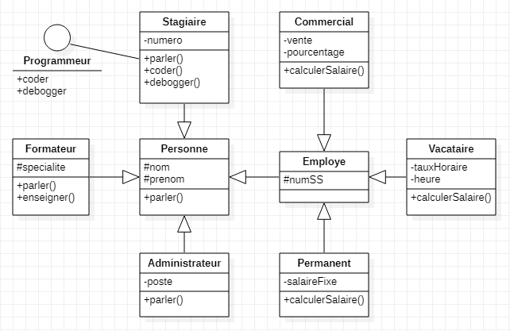

# Mini-TP : Centre de formation

Un centre de formation possède plusieurs catégories de personne :
- Des employés permanent ou non, des commerciaux, comptables, etc...
- Des extervenants/indépendants, comme les formateurs, l'administrateur réseau, etc...
- Et enfin les stagiaires, ceux qui suivent les formations.

## Fonctionnement

Pour pouvoir développer un site de gestion du centre de formation, on souhaiterai avoir les classes de nos modèles de données.

## TP

Je vous demande de me développer, grâce aux connaissances en objet que vous avez acquis jusque là, les classes de chacun des modèles.

----------

[Retour au sommaire](_Sidebar.md)
